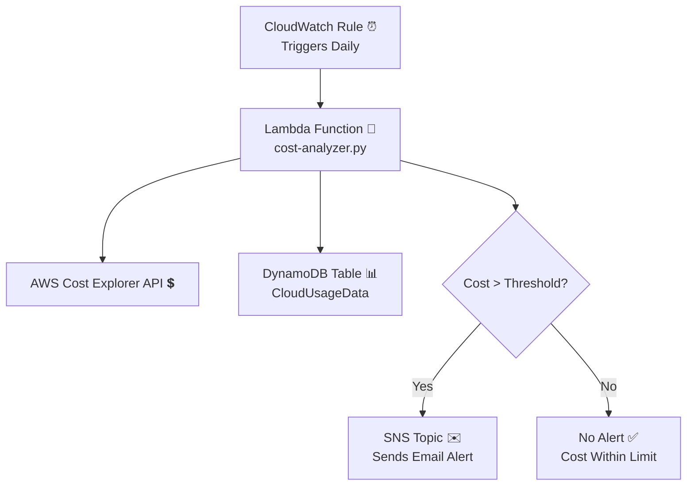

# ☁️ AWS Cloud Cost Monitoring & Alert System

### 🔹 Overview
This project automatically monitors **daily AWS cloud costs** and sends an **email alert** if the cost exceeds a defined threshold.  
It is a simple **serverless automation** built using AWS CLI, CloudWatch, Lambda, SNS, and DynamoDB.

---

### ⚙️ Services Used
- **AWS CloudWatch** → Triggers the Lambda function daily  
- **AWS Lambda** → Fetches daily cost and checks threshold  
- **AWS SNS** → Sends alert email when cost exceeds limit  
- **AWS DynamoDB** → Stores daily cost data  
- **AWS CLI + Shell Scripts** → Automates setup without console

---

### 🧩 How It Works
1. **CloudWatch Rule** triggers the **Lambda** function daily.  
2. **Lambda** uses **Cost Explorer API** to get the previous day’s spend.  
3. Cost data is stored in **DynamoDB**.  
4. If the cost is greater than the threshold, an **SNS email** is sent.  

---

## 🏗️ Architecture Diagram

---

### 🧠 Skills Demonstrated
- AWS CLI & Shell Scripting  
- Lambda, CloudWatch, SNS, DynamoDB  
- Serverless architecture & automation  
- Real-world cloud cost optimization  

